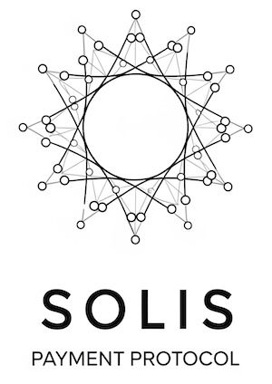

# Solis

A standardized protocol for simplifying cryptocurrency payments and eliminating common user errors.

## Overview

> **Note:** This specification is currently in a draft state. We are actively soliciting comments and proposals for improvement. Please contribute by opening an issue or submitting a pull request.

Solis aims to solve common problems in cryptocurrency payment flows:

- Paying on the wrong network (e.g., USDC on Ethereum vs. Base)
- Paying with the wrong asset (e.g., USDT instead of USDC)
- Entering incorrect payment amounts
- Manual address entry errors

This repository contains the specification and reference materials for the protocol.

## Key Benefits

- **Error Prevention**: Eliminates the most common payment mistakes
- **Simplified UX**: Reduces payment to scanning a QR code and selecting an asset
- **Cross-Chain Compatible**: Works across all blockchain networks
- **Open and Permissionless**: Solis is an open standard that can be adopted freely by any party without middlemen or facilitators.
- **Privacy-Preserving**: Minimal data collection with optional compliance information
- **Merchant-Friendly**: Simple REST API implementation
- **Wallet-Agnostic**: Can be implemented by any wallet provider
- **Real-time Pricing**: Gets up-to-date pricing information at the moment of payment

## Repository Contents

- [RFC.md](RFC.md) - The complete protocol specification
- [asset_codes.md](asset_codes.md) - Standardized network and asset codes for Solis
- [flow-diagram.md](flow-diagram.md) - Visual representation of the payment flow
- [examples.md](examples.md) - Implementation examples in various scenarios
- [/openapi/solis-openapi-spec.yaml](/openapi/solis-openapi-spec.yaml) - OpenAPI specification for the Solis API

## How It Works

1. **Merchant Creates Payment**: Generate a unique QR code with the Solis URI
2. **User Scans Code**: Wallet app recognizes the protocol and fetches payment details
3. **Asset List Retrieval**: Wallet gets list of supported assets/networks
4. **Asset Selection**: User selects which asset they want to pay with
5. **Quote Request**: Wallet requests exact amount in selected asset
6. **Payment Intent**: Wallet creates payment intent with selected asset and quote
7. **Simplified Payment**: The wallet executes the transaction with the exact parameters
8. **Transaction Notification**: Wallet notifies merchant about the submitted transaction
9. **Verification**: Payment status is confirmed through blockchain monitoring

## Use Cases for AI and Agentic Payments

The standardized and deterministic nature of the Solis protocol makes it an ideal payment rail for AI agents and other automated systems.

- **Programmatic Payments**: The simple REST API allows agents to execute payments without needing to interact with complex user interfaces or browser extensions.
- **Reduced Ambiguity**: By eliminating variables like network and asset selection through a clear API flow, agents can make payments reliably without human intervention.
- **Budgetary Control**: The quoting mechanism allows an agent to confirm the exact cost before committing to a transaction, enabling better financial management.
- **Universal Standard**: An agent that learns to use the Solis protocol can interact with any merchant that supports it, creating a universal payment method for the autonomous economy.

## Implementation

The protocol requires implementation by:

1. **Merchants/Payment Processors**: Implementing the required REST API endpoints
2. **Wallet Providers**: Adding support for the Solis URI scheme and flow

## API Endpoints

The Solis protocol defines the following REST API endpoints:

- `GET /{payment-id}` - Get payment information
- `GET /assets/{payment-id}` - List supported assets
- `POST /quote/{payment-id}` - Request payment quote  
- `POST /intent/{payment-id}` - Create payment intent
- `POST /notify/{payment-id}` - Transaction notification 

## Example Payment Flow

## Get Involved

Solis is an open standard that welcomes participation from:

- Wallet providers
- Payment processors
- Merchants
- Blockchain networks
- UX designers
- Crypto developers

## License

This specification is available under the MIT License. 