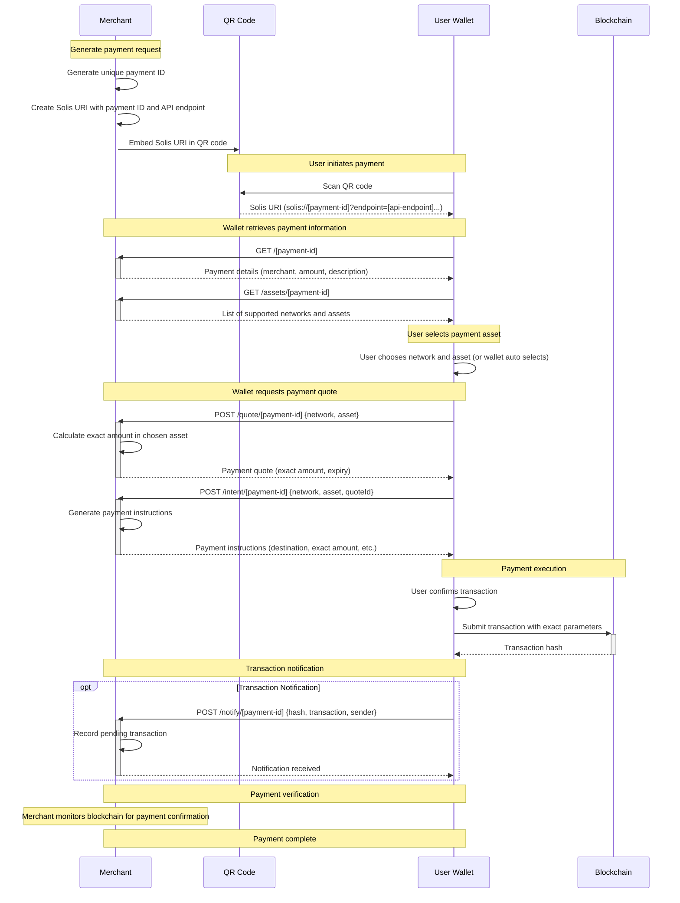

```mermaid
sequenceDiagram
    participant Merchant
    participant QR Code
    participant User Wallet
    participant Blockchain
    
    Note over Merchant: Generate payment request
    
    Merchant->>+Merchant: Generate unique payment ID
    Merchant->>Merchant: Create Solis URI with payment ID and API endpoint
    Merchant->>QR Code: Embed Solis URI in QR code
    
    Note over QR Code,User Wallet: User initiates payment
    
    User Wallet->>QR Code: Scan QR code
    QR Code-->>User Wallet: Solis URI (solis://[payment-id]?endpoint=[api-endpoint]...)
    
    Note over User Wallet,Merchant: Wallet retrieves payment information
    
    User Wallet->>+Merchant: GET /[payment-id]
    Merchant-->>-User Wallet: Payment details (merchant, amount, description)
    
    User Wallet->>+Merchant: GET /assets/[payment-id]
    Merchant-->>-User Wallet: List of supported networks and assets
    
    Note over User Wallet: User selects payment asset
    
    User Wallet->>User Wallet: User chooses network and asset (or wallet auto selects)
    
    Note over User Wallet,Merchant: Wallet requests payment quote
    
    User Wallet->>+Merchant: POST /quote/[payment-id] {network, asset}
    Merchant->>Merchant: Calculate exact amount in chosen asset
    Merchant-->>-User Wallet: Payment quote (exact amount, expiry)
    
    User Wallet->>+Merchant: POST /intent/[payment-id] {network, asset, quoteId}
    Merchant->>Merchant: Generate payment instructions
    Merchant-->>-User Wallet: Payment instructions (destination, exact amount, etc.)
    
    Note over User Wallet,Blockchain: Payment execution
    
    User Wallet->>User Wallet: User confirms transaction
    User Wallet->>+Blockchain: Submit transaction with exact parameters
    Blockchain-->>-User Wallet: Transaction hash
    
    Note over User Wallet,Merchant: Transaction notification
    
    opt Transaction Notification
        User Wallet->>+Merchant: POST /notify/[payment-id] {hash, transaction, sender}
        Merchant->>Merchant: Record pending transaction
        Merchant-->>-User Wallet: Notification received
    end
    
    Note over User Wallet,Merchant: Payment verification
    
    Note over Merchant: Merchant monitors blockchain for payment confirmation
    
    Note over User Wallet,Merchant: Payment complete
``` 